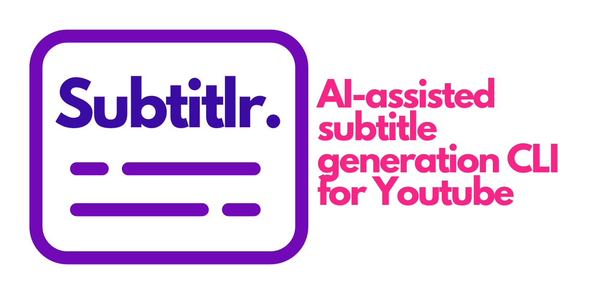

# Subtitlr (Experimental)

[](https://github.com/yoanbernabeu/Subtitlr/releases/latest)
[](./LICENSE)

AI-assisted subtitle generation CLI for Youtube



## Description

This application, a subtitle generator for YouTube, utilizes OpenAI's Whisper API.

This tool leverages artificial intelligence to efficiently transcribe speech in YouTube videos into text, thereby generating accurate subtitles (in SRT format).

It's designed to improve the accessibility and convenience of video content, ensuring that no matter your language or hearing ability, you can fully engage with and comprehend the material.

## Features

### Generate subtitles - The simplest way

The simplest way to use Subtitlr without configuration is to use the following command:

```bash
Subtitlr generate --id qJpR1NBx4cU --lang fr --output output.srt --apiKey sk-****************************
```

### Generate subtitles - With configuration

You can also use a `.env` file to store your API key (in `OPENAI_API_KEY` variable) and use the following command:

```bash
Subtitlr configure --apiKey sk-****************************
```

And after that, you can use the following command without the `--apiKey` parameter:

```bash
Subtitlr generate --id qJpR1NBx4cU --lang fr --output output.srt
```

### Translating subtitles

For translations we offer you the possibility to use the DeepL API with a free account only (500000 per month).

You must have previously generated your subtitle file with the `generate` command.

You can use the following command to translate subtitles:

```bash
Subtitlr translate --input input.srt --lang EN --output output_EN.srt --apiKeyDeepl ****************************
```

## Requirements

* [OpenAI API key](https://beta.openai.com/)
* [FFmpeg](https://ffmpeg.org/)
* Linux (tested on Ubuntu 22.04), MacOS (not tested), Windows (not tested)
* You have read/write rights to the current directory

## Parameters

### `generate` command

| Name | Description | Required |
| --- | --- | --- |
| id | Youtube video id | true |
| lang | Language speaking in the video (in ISO 639-1 format) | true |
| output | Output file | true |
| apiKey | OpenAI API key | false (if you use the `configure` command) |

### `translate` command

| Name | Description | Required |
| --- | --- | --- |
| input | Input file | true |
| lang | Language to translate (in ISO 639-1 format) | true |
| output | Output file | true |
| apiKeyDeepl | DeepL API key | true |

## Installation

### From binary

* Linux/Darwin

_Using cURL_

```bash
wget -qO- https://raw.githubusercontent.com/yoanbernabeu/Subtitlr/main/install.sh | bash
```

_Using wget_

```bash
curl -sL https://raw.githubusercontent.com/yoanbernabeu/Subtitlr/main/install.sh | bash
```

* Windows (Not tested): Download the [latest release](https://github.com/yoanbernabeu/Subtitlr/releases)

### From source

> Subtitlr is written in Go, so you need to install it first.

```bash
git clone git@github.com:yoanbernabeu/Subtitlr.git
cd Subtitlr
go build -o Subtitlr
```

## License

[MIT](LICENSE)

## Contributing

Pull requests are welcome. For major changes, please open an issue first to discuss what you would like to change.